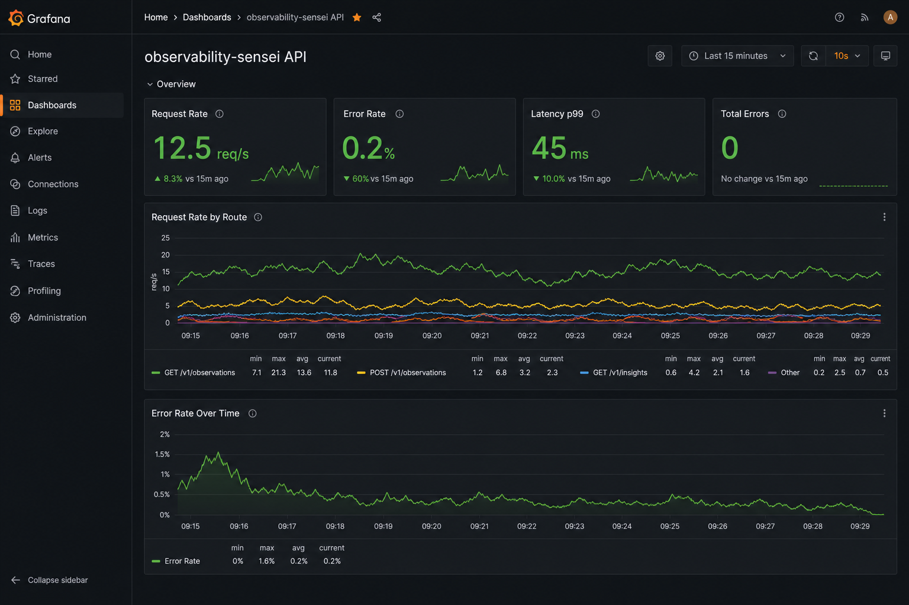
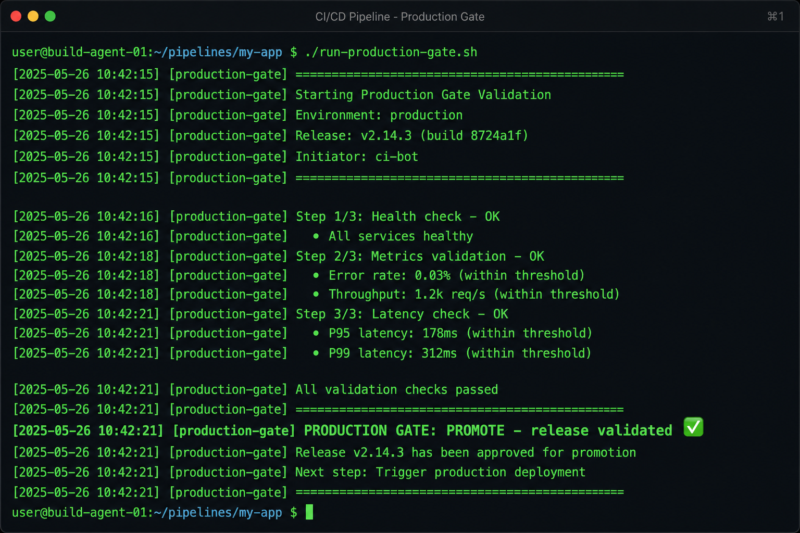
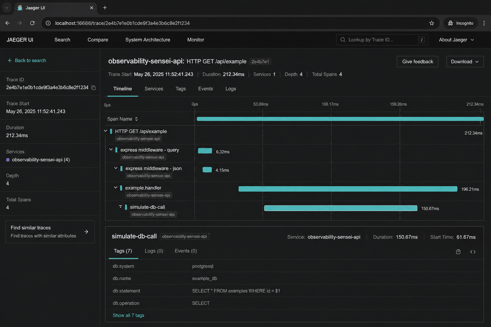

# observability-sensei

> **Ship with confidence, not hope.**

[](https://github.com/samuelcamilodacosta/observability-sensei/actions/workflows/ci.yml)
[](https://github.com/samuelcamilodacosta/observability-sensei/actions/workflows/integration.yml)
[](https://github.com/samuelcamilodacosta/observability-sensei/actions/workflows/deploy-with-observability.yml)
[](LICENSE)

**observability-sensei** is a production-grade educational repository that teaches developers how to go beyond traditional CI/CD and adopt **observability-first delivery** — where every release is validated in production using logs, metrics, traces, and automated gates before you promote or rollback.

**Documentação em português:** [`docs/pt/README.md`](docs/pt/README.md)

---

## Screenshots

| Grafana — RED metrics dashboard | Production Gate — promote / rollback |
|:---:|:---:|
|  |  |

| Jaeger — distributed traces |
|:---:|
|  |

---

## Quickstart (5 minutes)

```bash
git clone https://github.com/samuelcamilodacosta/observability-sensei.git
cd observability-sensei
npm run demo          # Git Bash / Linux / Mac
# Windows PowerShell:
npm run demo:ps1
```

Opens: API · Prometheus · Grafana · Loki · Jaeger · runs Production Gate.

**Generate traffic only** (stack already running):

```powershell
npm run traffic:ps1 -- -Ok 30 -Errors 5 -Slow 1
# Git Bash:
npm run traffic -- --ok 30 --errors 5 --slow 1
```

---

## Learning paths

| Level | Time | You will |
|-------|------|----------|
| **Level 1** | 30 min | Run API + health checks + CI locally |
| **Level 2** | 1 h | Full Docker stack + Grafana dashboard + Jaeger traces |
| **Level 3** | 2 h | Production Gate + rollback + canary + [labs](docs/labs/) |

### Level 1 — API + health

```bash
cd examples/node-api && npm install && npm run dev
./examples/scripts/health-check.sh http://localhost:3000/health
```

Docs: [`docs/00-intro.md`](docs/00-intro.md) → [`docs/01-ci-cd-basics.md`](docs/01-ci-cd-basics.md)

### Level 2 — Observability stack

```bash
npm run stack:up
```

| Service | URL |
|---------|-----|
| API | http://localhost:3000/health |
| Prometheus | http://localhost:9090 |
| Grafana | http://localhost:3001 (admin / sensei) |
| Loki | http://localhost:3100 (via Grafana Explore) |
| Jaeger | http://localhost:16686 |
| Dashboard | Grafana → **observability-sensei API** |

**Logs in Grafana Explore** (Loki):

```logql
{compose_service="api"} | json | level="info"
```

Docs: [`docs/02-observability-fundamentals.md`](docs/02-observability-fundamentals.md)

### Level 3 — Production Gate

```bash
./examples/scripts/production-gate.sh
./examples/scripts/canary-mock.sh
```

Labs: [`docs/labs/`](docs/labs/) · PT: [`docs/pt/labs/`](docs/pt/labs/)

---

## Why observability-first CI/CD?

Traditional pipelines answer: *"Did the build pass?"*

Observability-driven pipelines answer: *"Did the release actually work for users?"*

This repo shows how senior platform teams think: **deploy → observe → decide → act**.

---

## Architecture

```
┌──────────┐    ┌────┐    ┌───────┐    ┌────────┐    ┌─────────┐    ┌────────┐    ┌──────────────────┐
│   Code   │───▶│ CI │───▶│ Build │───▶│ Deploy │───▶│ Observe │───▶│ Decide │───▶│ Rollback/Promote │
└──────────┘    └────┘    └───────┘    └────────┘    └─────────┘    └────────┘    └──────────────────┘
                                              │              │              │
                                              └──── Production Gate ─────────┘
```

---

## What you'll learn

| Topic | EN | PT |
|-------|----|----|
| CI/CD | [`docs/01`](docs/01-ci-cd-basics.md) | [`docs/pt/01`](docs/pt/01-ci-cd-basics.md) |
| Observability | [`docs/02`](docs/02-observability-fundamentals.md) | [`docs/pt/02`](docs/pt/02-observability-fundamentals.md) |
| Logs/metrics/traces | [`docs/03`](docs/03-logs-metrics-traces.md) | [`docs/pt/03`](docs/pt/03-logs-metrics-traces.md) |
| Release validation | [`docs/04`](docs/04-release-observability.md) | [`docs/pt/04`](docs/pt/04-release-observability.md) |
| DORA | [`docs/05`](docs/05-dora-metrics.md) | [`docs/pt/05`](docs/pt/05-dora-metrics.md) |
| Rollback | [`docs/06`](docs/06-rollback-strategies.md) | [`docs/pt/06`](docs/pt/06-rollback-strategies.md) |
| Alerting | [`docs/07`](docs/07-alerting.md) | [`docs/pt/07`](docs/pt/07-alerting.md) |
| Architecture | [`docs/08`](docs/08-production-architecture.md) | [`docs/pt/08`](docs/pt/08-production-architecture.md) |

---

## Repository structure

```
observability-sensei/
├── package.json             # npm run demo | test | stack:up | gate
├── scripts/                 # demo.sh, demo.ps1
├── docs/ + docs/pt/         # EN + PT documentation
├── docs/labs/               # Hands-on labs
├── examples/
│   ├── node-api/
│   ├── github-actions/
│   ├── scripts/ + ps1/
│   └── k8s/
├── stacks/                  # Prometheus, Grafana, OTel, Loki guide
└── docker-compose.yml
```

---

## Production Gate

Post-deploy stage that decides **promote** or **rollback**:

1. Health — `/health` returns 200 + `status: ok`
2. Error rate — default &lt; 5% (`VERIFY_MODE=direct` or `prometheus`)
3. Latency — p99 &lt; 500ms

```bash
./examples/scripts/production-gate.sh
# Windows:
./examples/scripts/ps1/production-gate.ps1
```

---

## Next steps (real-world)

| Pattern | Location |
|---------|----------|
| Canary deploy | [`examples/scripts/canary-mock.sh`](examples/scripts/canary-mock.sh) |
| K8s probes | [`examples/k8s/`](examples/k8s/) |
| PromQL in CI | `VERIFY_MODE=prometheus ./examples/scripts/verify-metrics.sh` |
| Grafana deploy marks | [`examples/scripts/annotate-deploy-grafana.sh`](examples/scripts/annotate-deploy-grafana.sh) |
| Alert rules | [`stacks/prometheus/alerts.yml`](stacks/prometheus/alerts.yml) |

Active workflows: [`.github/workflows/`](.github/workflows/) — CI, integration (Docker + scripts), deploy-with-observability.

---

## License

MIT — use it, fork it, teach with it.

**Built for engineers who want to stop hoping deployments work and start knowing they do.**
